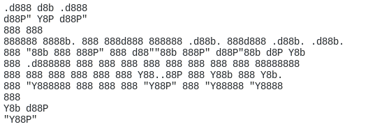

<p align="center">
  <picture>
    <source media="(prefers-color-scheme: dark)" srcset="docs/assets/logo-dark.svg">
    <source media="(prefers-color-scheme: light)" srcset="docs/assets/logo-light.svg">
    
  </picture>
</p>
<p align="center">
  <strong>Performance-measurement library for evaluating AI models and assistants</strong>
</p>

<p align="center">
  <a href="https://github.com/Alquimia-ai/fair-forge/actions/workflows/release.yml"></a>
  <a href="https://pypi.org/project/alquimia-fair-forge/"></a>
  <a href="https://pypi.org/project/alquimia-fair-forge/"></a>
  <a href="https://github.com/Alquimia-ai/fair-forge/blob/main/LICENSE"></a>
</p>

<p align="center">
  <a href="https://fairforge.alquimia.ai">Documentation</a> •
  <a href="https://github.com/Alquimia-ai/fair-forge">GitHub</a>
</p>

## What is Fair Forge?

Fair Forge provides comprehensive metrics for evaluating AI systems:

- **Toxicity** - Detect toxic language patterns with DIDT fairness framework
- **Bias** - Analyze biases across protected attributes (gender, race, religion, etc.)
- **Context** - Assess how well responses align with provided context
- **Conversational** - Evaluate dialogue quality using Grice's maxims
- **Humanity** - Measure how natural responses are through emotional analysis
- **BestOf** - Tournament-style comparison to find the best response
- **Agentic** - Evaluate autonomous agent behavior and tool usage

## Quick Start

```bash
# Install with pip
pip install alquimia-fair-forge

# Or install specific modules
pip install "alquimia-fair-forge[toxicity]"
pip install "alquimia-fair-forge[bias]"
pip install "alquimia-fair-forge[all]"
```

```python
from fair_forge import Retriever, Dataset
from fair_forge.metrics.toxicity import Toxicity

class MyRetriever(Retriever):
    def load_dataset(self) -> list[Dataset]:
        # Load your dataset here
        pass

metrics = Toxicity.run(MyRetriever, verbose=True)
```

## Documentation

For complete documentation, guides, and API reference visit:

**[https://fairforge.alquimia.ai](https://fairforge.alquimia.ai)**

## Contributing

### Setup

```bash
# Clone and install dependencies
git clone https://github.com/Alquimia-ai/fair-forge.git
cd fair-forge
uv sync

# Install pre-commit hooks (required)
uv run pre-commit install --hook-type pre-commit --hook-type commit-msg
```

### Pre-commit Hooks

This project uses [pre-commit](https://pre-commit.com/) to enforce code quality and commit conventions. The following hooks run automatically:

| Hook | Stage | Purpose |
|------|-------|---------|
| `trailing-whitespace` | pre-commit | Remove trailing whitespace |
| `end-of-file-fixer` | pre-commit | Ensure files end with a newline |
| `check-yaml` / `check-toml` | pre-commit | Validate config files |
| `check-added-large-files` | pre-commit | Block files >1MB |
| `detect-private-key` | pre-commit | Prevent accidental secret commits |
| `ruff` | pre-commit | Lint and auto-fix Python code |
| `ruff-format` | pre-commit | Format Python code |
| `commitizen` | commit-msg | Enforce [Conventional Commits](https://www.conventionalcommits.org/) format |

### Commit Convention

All commits **must** follow the [Conventional Commits](https://www.conventionalcommits.org/) specification, enforced by [commitizen](https://commitizen-tools.github.io/commitizen/):

```
type(scope): description
```

**Types:** `feat`, `fix`, `docs`, `style`, `refactor`, `perf`, `test`, `build`, `ci`, `chore`

**Scopes:** `metrics`, `runners`, `generators`, `storage`, `schemas`, `core`, `llm`, `guardians`, `deps`

Examples:
```
feat(metrics): add agentic evaluation metric
fix(toxicity): handle empty batches
docs: update installation guide
test(runners): add integration tests
```

### Claude Code Skills

This project includes [Claude Code](https://claude.ai/code) skills to automate common workflows. If you use Claude Code as your development tool, the following skills are available:

| Skill | Command | Description |
|-------|---------|-------------|
| **Commit** | `/commit` | Analyzes staged changes and generates a properly formatted Conventional Commit message |
| **Docs** | `/docs [type] [name]` | Generates Mintlify MDX documentation for new modules (e.g., `/docs metric agentic`) |
| **Lambda** | `/fair-forge-lambda` | Scaffolds AWS Lambda deployment boilerplate for Fair-Forge modules |

## License

MIT License - see [LICENSE](LICENSE) for details.
