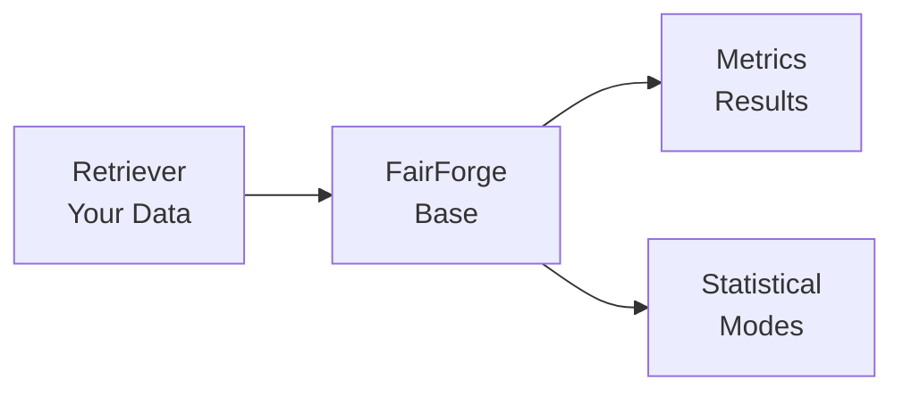

# Architecture

Fair Forge follows a simple yet powerful architecture designed for extensibility and ease of use.

## Overview

<Frame>

</Frame>

## Data Flow

The core data flow in Fair Forge is:

1. **Retriever** loads your conversation data as `list[Dataset]`
2. **FairForge** base class iterates through datasets
3. **Metric** implementations process each conversation batch
4. **Results** are collected in `self.metrics`

<Steps>
  <Step title="Load Data">
    `Retriever.load_dataset()` returns `list[Dataset]`
  </Step>
  <Step title="Process Datasets">
    `FairForge._process()` iterates through datasets
  </Step>
  <Step title="Compute Metrics">
    `Metric.batch()` processes each conversation
  </Step>
  <Step title="Collect Results">
    Results stored in `self.metrics`
  </Step>
</Steps>

## Core Components

### FairForge Base Class

All metrics inherit from `FairForge` (`fair_forge/core/base.py`):

```python
from abc import ABC, abstractmethod
from typing import Type
from fair_forge.core.retriever import Retriever

class FairForge(ABC):
    def __init__(self, retriever: Type[Retriever], verbose: bool = False, **kwargs):
        self.retriever = retriever(**kwargs)
        self.metrics = []
        self.verbose = verbose

    @abstractmethod
    def batch(self, session_id: str, context: str, assistant_id: str,
              batch: list[Batch], language: str | None) -> None:
        """Process a batch of conversations. Implemented by each metric."""
        pass

    @classmethod
    def run(cls, retriever: Type[Retriever], **kwargs) -> list:
        """One-shot execution: instantiate and process."""
        instance = cls(retriever, **kwargs)
        instance._process()
        return instance.metrics
```

### Retriever

Abstract base class for data loading:

```python
from abc import ABC, abstractmethod
from fair_forge.schemas.common import Dataset

class Retriever(ABC):
    def __init__(self, **kwargs):
        pass

    @abstractmethod
    def load_dataset(self) -> list[Dataset]:
        """Load and return datasets for evaluation."""
        pass
```

### Data Structures

**Dataset**: A complete conversation session
```python
class Dataset(BaseModel):
    session_id: str          # Unique session identifier
    assistant_id: str        # ID of the assistant being evaluated
    language: str | None     # Language code (e.g., "english")
    context: str             # System context/instructions
    conversation: list[Batch] # List of Q&A interactions
```

**Batch**: A single Q&A interaction
```python
class Batch(BaseModel):
    qa_id: str                          # Unique interaction ID
    query: str                          # User question
    assistant: str                      # Assistant response
    ground_truth_assistant: str | None  # Expected response
    observation: str | None             # Additional notes
    agentic: dict | None                # Metadata
    ground_truth_agentic: dict | None   # Expected metadata
    logprobs: dict | None               # Log probabilities
```

## Metric Architecture

Each metric follows this pattern:

```python
from fair_forge.core.base import FairForge

class MyMetric(FairForge):
    def __init__(self, retriever, verbose=False, **kwargs):
        super().__init__(retriever, verbose, **kwargs)
        # Initialize metric-specific components

    def batch(self, session_id, context, assistant_id, batch, language):
        # Process the batch and compute metrics
        result = self._compute(batch)
        self.metrics.append(result)
```

## Statistical Modes

Fair Forge supports two statistical approaches:

<Tabs>
  <Tab title="Frequentist">
    Returns point estimates (floats):
    ```python
    from fair_forge.statistical import FrequentistMode

    metrics = Toxicity.run(
        MyRetriever,
        statistical_mode=FrequentistMode(),
    )
    # Returns: metric.group_profiling.frequentist.DIDT = 0.33
    ```
  </Tab>
  <Tab title="Bayesian">
    Returns full posterior distributions:
    ```python
    from fair_forge.statistical import BayesianMode

    bayesian = BayesianMode(
        mc_samples=5000,
        ci_level=0.95,
    )
    metrics = Toxicity.run(
        MyRetriever,
        statistical_mode=bayesian,
    )
    # Returns: metric.group_profiling.bayesian.summary['DIDT']
    # {mean: 0.17, ci_low: 0.08, ci_high: 0.27}
    ```
  </Tab>
</Tabs>

## Module Structure

```
fair_forge/
├── core/
│   ├── base.py           # FairForge base class
│   ├── retriever.py      # Retriever abstract class
│   ├── guardian.py       # Guardian interface (bias detection)
│   ├── sentiment.py      # Sentiment analyzer interface
│   ├── loader.py         # Toxicity loader interface
│   └── extractor.py      # Group extractor interface
├── metrics/
│   ├── toxicity.py       # Toxicity metric
│   ├── bias.py           # Bias metric
│   ├── context.py        # Context metric
│   ├── conversational.py # Conversational metric
│   ├── humanity.py       # Humanity metric
│   └── best_of.py        # BestOf metric
├── schemas/
│   ├── common.py         # Dataset, Batch schemas
│   ├── toxicity.py       # Toxicity result schemas
│   ├── bias.py           # Bias result schemas
│   └── ...               # Other metric schemas
├── statistical/
│   ├── base.py           # StatisticalMode interface
│   ├── frequentist.py    # Frequentist implementation
│   └── bayesian.py       # Bayesian implementation
├── generators/           # Test dataset generation
├── runners/              # Test execution
├── storage/              # Storage backends
├── llm/                  # LLM integration (Judge)
├── guardians/            # Guardian implementations
├── extractors/           # Group extractor implementations
└── loaders/              # Toxicity lexicon loaders
```

## Extension Points

Fair Forge is designed for extensibility:

| Component | Interface | Purpose |
|-----------|-----------|---------|
| `Retriever` | `load_dataset()` | Load custom data sources |
| `Guardian` | `is_biased()` | Custom bias detection |
| `SentimentAnalyzer` | `infer()` | Custom sentiment analysis |
| `ToxicityLoader` | `load()` | Custom toxicity lexicons |
| `BaseGroupExtractor` | `detect_one()` | Custom group detection |
| `StatisticalMode` | Various methods | Custom statistical analysis |
| `BaseRunner` | `run_batch()` | Custom test execution |
| `BaseStorage` | `load_datasets()` | Custom storage backends |

## Next Steps

<CardGroup cols={2}>
  <Card title="Retriever" icon="database" href="/core-concepts/retriever">
    Learn how to create custom retrievers
  </Card>
  <Card title="Dataset & Batch" icon="table" href="/core-concepts/dataset-batch">
    Understand data structures
  </Card>
</CardGroup>
