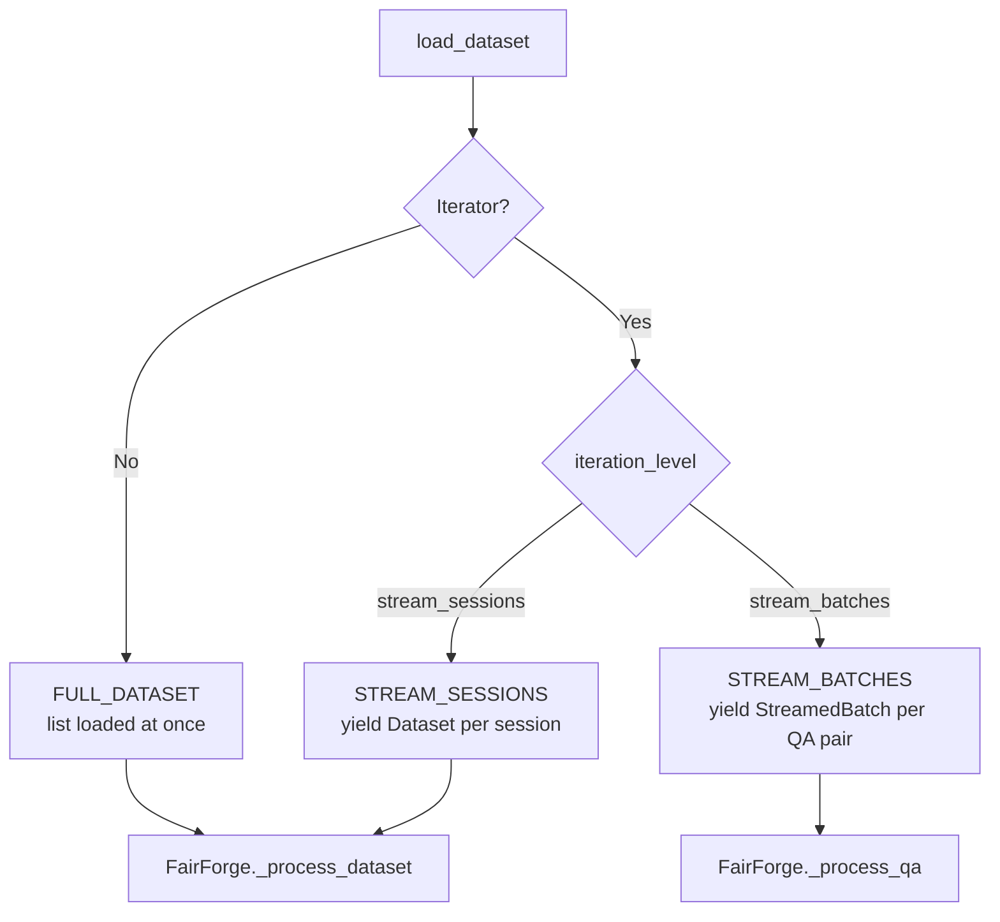

# Streaming Retrievers

Fair Forge supports lazy iteration over datasets through two streaming modes. Instead of returning a full list from `load_dataset()`, a streaming retriever returns a generator. The framework detects this automatically and routes processing through the appropriate strategy.

<Frame>

</Frame>

## Schemas

Streaming introduces two new types from `fair_forge.schemas.common`:

```python
from fair_forge.schemas.common import IterationLevel, SessionMetadata, StreamedBatch

class IterationLevel(str, Enum):
    FULL_DATASET = "full_dataset"   # default
    STREAM_SESSIONS = "stream_sessions"
    STREAM_BATCHES = "stream_batches"

class SessionMetadata(BaseModel):
    session_id: str
    assistant_id: str
    language: str | None  # default: "english"
    context: str

class StreamedBatch(BaseModel):
    metadata: SessionMetadata  # session-level info
    batch: Batch               # the individual QA pair
```

`StreamedBatch` is the unit yielded in `STREAM_BATCHES` mode. It carries the session context (`metadata`) alongside a single interaction (`batch`), because each QA pair no longer belongs to a parent `Dataset` container.

## stream_sessions

Yield one complete `Dataset` session at a time. Memory footprint is bounded to a single session. The processing logic is identical to `FULL_DATASET` — each session's full conversation is available in `batch()`.

```python
from collections.abc import Iterator
from fair_forge.core.retriever import Retriever
from fair_forge.schemas.common import Dataset, IterationLevel

class StreamingSessionRetriever(Retriever):
    def __init__(self, file_path: str = "data.json", **kwargs):
        super().__init__(**kwargs)
        self.file_path = file_path

    @property
    def iteration_level(self) -> IterationLevel:
        return IterationLevel.STREAM_SESSIONS

    def load_dataset(self) -> Iterator[Dataset]:
        import json
        with open(self.file_path) as f:
            for raw in json.load(f):
                yield Dataset.model_validate(raw)

# Usage — identical to full_dataset mode from the caller's perspective
metrics = Context.run(
    StreamingSessionRetriever,
    file_path="large_dataset.json",
    model=judge_model,
)
```

### When to use `stream_sessions`

- You have many sessions but each session fits easily in memory
- Sessions are independent and require no cross-session state
- You want a simple drop-in replacement for `FULL_DATASET` with lower memory usage
- Your data source is a file, database cursor, or any iterable you cannot fully materialise

## stream_batches

Yield one `StreamedBatch` (a single QA pair) at a time. The metric's `batch()` method receives a one-item list for each call. This is the lowest-memory mode and the most granular.

```python
from collections.abc import Iterator
from fair_forge.core.retriever import Retriever
from fair_forge.schemas.common import Dataset, IterationLevel, SessionMetadata, StreamedBatch

class StreamingBatchRetriever(Retriever):
    def __init__(self, file_path: str = "data.json", **kwargs):
        super().__init__(**kwargs)
        self.file_path = file_path

    @property
    def iteration_level(self) -> IterationLevel:
        return IterationLevel.STREAM_BATCHES

    def load_dataset(self) -> Iterator[StreamedBatch]:
        import json
        with open(self.file_path) as f:
            for raw in json.load(f):
                dataset = Dataset.model_validate(raw)
                metadata = SessionMetadata(
                    session_id=dataset.session_id,
                    assistant_id=dataset.assistant_id,
                    language=dataset.language,
                    context=dataset.context,
                )
                for batch in dataset.conversation:
                    yield StreamedBatch(metadata=metadata, batch=batch)
```

### Streaming from a message queue

`stream_batches` is ideal when QA pairs arrive from a live source:

```python
from collections.abc import Iterator
from fair_forge.core.retriever import Retriever
from fair_forge.schemas.common import Batch, IterationLevel, SessionMetadata, StreamedBatch

class QueueRetriever(Retriever):
    def __init__(self, queue_url: str, session_id: str, assistant_id: str, **kwargs):
        super().__init__(**kwargs)
        self.queue_url = queue_url
        self.session_id = session_id
        self.assistant_id = assistant_id

    @property
    def iteration_level(self) -> IterationLevel:
        return IterationLevel.STREAM_BATCHES

    def load_dataset(self) -> Iterator[StreamedBatch]:
        metadata = SessionMetadata(
            session_id=self.session_id,
            assistant_id=self.assistant_id,
            context="",
        )
        for message in self._consume_queue():
            yield StreamedBatch(
                metadata=metadata,
                batch=Batch(
                    qa_id=message["id"],
                    query=message["query"],
                    assistant=message["response"],
                    ground_truth_assistant=message.get("expected", ""),
                ),
            )

    def _consume_queue(self):
        # Connect to your message queue (SQS, Kafka, Redis Streams, etc.)
        ...
```

### When to use `stream_batches`

- QA pairs arrive from a queue or streaming API (no session container)
- You want the minimum possible memory footprint
- Metrics don't require access to adjacent QA pairs within the same session
- You're building a real-time evaluation pipeline

<Note>
  BestOf works with all three modes, but the granularity follows how batches are formed. With `full_dataset` or `stream_sessions`, each batch contains all QA pairs in a session, so BestOf compares the entire conversation as a single block (one tournament per session / block of `qa_id`s). With `stream_batches`, each batch is a single QA pair, so BestOf runs a single king-of-the-hill comparison per question and produces exactly one result per `qa_id` instead of per session.
</Note>

## Choosing the Right Mode

| | `full_dataset` | `stream_sessions` | `stream_batches` |
|---|---|---|---|
| Memory | All sessions loaded | One session at a time | One QA pair at a time |
| Data source | In-memory list | File / DB cursor / API | Queue / stream |
| Cross-session state | ✅ | ❌ | ❌ |
| Cross-QA state in session | ✅ | ✅ | ❌ |
| Compatible with all metrics | ✅ | ✅ | Most metrics ✅ |
| Real-time processing | ❌ | ❌ | ✅ |

## Next Steps

<CardGroup cols={2}>
  <Card title="Retriever Overview" icon="database" href="/core-concepts/retriever">
    Full dataset mode examples and retriever interface
  </Card>
  <Card title="Dataset & Batch" icon="table" href="/core-concepts/dataset-batch">
    Understand Dataset, Batch, and SessionMetadata structures
  </Card>
</CardGroup>
