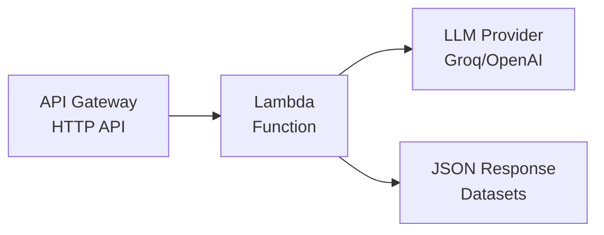

# AWS Lambda Deployment

Deploy Fair Forge generators, runners, and metrics as AWS Lambda functions for serverless execution.

## Available Lambda Functions

| Function | Purpose | Endpoint |
|----------|---------|----------|
| **BestOf** | Tournament-style AI assistant comparison | `POST /run` |
| **Generators** | Generate test datasets from context | `POST /run` |
| **Runners** | Execute tests against AI systems | `POST /run` |

## BestOf Metric Lambda

Run tournament-style comparisons between multiple AI assistants to determine which performs best.

### How It Works

1. Submit datasets from multiple assistants (same questions, different responses)
2. The LLM judge evaluates head-to-head matchups
3. Winners advance through elimination rounds
4. Returns the tournament winner with detailed contest results

### Supported LLM Providers

| Provider | class_path |
|----------|-----------|
| Groq | `langchain_groq.chat_models.ChatGroq` |
| OpenAI | `langchain_openai.chat_models.ChatOpenAI` |
| Google Gemini | `langchain_google_genai.chat_models.ChatGoogleGenerativeAI` |
| Ollama | `langchain_ollama.chat_models.ChatOllama` |

### Request Format

```json
{
  "connector": {
    "class_path": "langchain_groq.chat_models.ChatGroq",
    "params": {
      "model": "qwen/qwen3-32b",
      "api_key": "your-api-key",
      "temperature": 0.0
    }
  },
  "datasets": [
    {
      "session_id": "comparison_session",
      "assistant_id": "assistant_a",
      "language": "english",
      "context": "System context...",
      "conversation": [
        {
          "qa_id": "q1",
          "query": "User question",
          "assistant": "Assistant A response",
          "ground_truth_assistant": "Expected response (optional)"
        }
      ]
    },
    {
      "session_id": "comparison_session",
      "assistant_id": "assistant_b",
      "language": "english",
      "context": "System context...",
      "conversation": [
        {
          "qa_id": "q1",
          "query": "User question",
          "assistant": "Assistant B response",
          "ground_truth_assistant": "Expected response (optional)"
        }
      ]
    }
  ],
  "config": {
    "criteria": "Overall response quality",
    "use_structured_output": true
  }
}
```

### Configuration Parameters

| Parameter | Type | Default | Description |
|-----------|------|---------|-------------|
| `criteria` | `str` | `"Overall response quality"` | Evaluation criteria for judging |
| `use_structured_output` | `bool` | `true` | Use LangChain structured output |
| `verbose` | `bool` | `false` | Enable verbose logging |

### Example: Compare Two Assistants

```bash
curl -s -X POST "https://your-lambda-url/run" \
  -H "Content-Type: application/json" \
  -d '{
    "connector": {
      "class_path": "langchain_groq.chat_models.ChatGroq",
      "params": {
        "model": "qwen/qwen3-32b",
        "api_key": "your-groq-api-key",
        "temperature": 0.0
      }
    },
    "datasets": [
      {
        "session_id": "comparison",
        "assistant_id": "gpt4_responses",
        "language": "english",
        "context": "",
        "conversation": [
          {
            "qa_id": "q1",
            "query": "What are the benefits of renewable energy?",
            "assistant": "Renewable energy offers numerous benefits including reduced greenhouse gas emissions, energy independence, job creation, and long-term cost savings."
          },
          {
            "qa_id": "q2",
            "query": "Explain machine learning simply.",
            "assistant": "Machine learning is a type of AI where computers learn patterns from data rather than following explicit programming rules."
          }
        ]
      },
      {
        "session_id": "comparison",
        "assistant_id": "claude_responses",
        "language": "english",
        "context": "",
        "conversation": [
          {
            "qa_id": "q1",
            "query": "What are the benefits of renewable energy?",
            "assistant": "Clean energy good. Sun power help planet."
          },
          {
            "qa_id": "q2",
            "query": "Explain machine learning simply.",
            "assistant": "Computer learns things from data."
          }
        ]
      }
    ],
    "config": {
      "criteria": "Response quality, clarity, completeness, and accuracy"
    }
  }'
```

### Response Format

```json
{
  "success": true,
  "winner": "gpt4_responses",
  "contestants": ["gpt4_responses", "claude_responses"],
  "total_rounds": 1,
  "contests": [
    {
      "round": 1,
      "left": "gpt4_responses",
      "right": "claude_responses",
      "winner": "gpt4_responses",
      "confidence": 0.95,
      "verdict": "Assistant A provides more comprehensive and well-structured responses",
      "reasoning": "Detailed analysis of the comparison..."
    }
  ]
}
```

### Response Fields

| Field | Type | Description |
|-------|------|-------------|
| `winner` | `str` | The assistant_id of the tournament winner |
| `contestants` | `list` | All assistant_ids that participated |
| `total_rounds` | `int` | Number of tournament rounds |
| `contests` | `list` | Details of each head-to-head matchup |
| `contests[].confidence` | `float` | Judge's confidence in decision (0-1) |
| `contests[].verdict` | `str` | Brief summary of the decision |
| `contests[].reasoning` | `str` | Detailed reasoning for the decision |

---

## Generators Lambda

Generate synthetic test datasets from markdown content using any LLM.

### Supported LLM Providers

| Provider | class_path |
|----------|-----------|
| Groq | `langchain_groq.chat_models.ChatGroq` |
| OpenAI | `langchain_openai.chat_models.ChatOpenAI` |
| Google Gemini | `langchain_google_genai.chat_models.ChatGoogleGenerativeAI` |
| Ollama | `langchain_ollama.chat_models.ChatOllama` |

### Request Format

```json
{
  "connector": {
    "class_path": "langchain_groq.chat_models.ChatGroq",
    "params": {
      "model": "qwen/qwen3-32b",
      "api_key": "your-api-key",
      "temperature": 0.7
    }
  },
  "context": "# Your Markdown Content\n\nContent to generate questions from...",
  "config": {
    "assistant_id": "my-assistant",
    "num_queries": 3,
    "language": "english",
    "conversation_mode": false,
    "max_chunk_size": 2000,
    "min_chunk_size": 200,
    "seed_examples": ["Example question 1?", "Example question 2?"]
  }
}
```

### Configuration Parameters

| Parameter | Type | Default | Description |
|-----------|------|---------|-------------|
| `assistant_id` | `str` | Required | ID for generated dataset |
| `num_queries` | `int` | `3` | Questions per chunk |
| `language` | `str` | `"english"` | Language for generation |
| `conversation_mode` | `bool` | `false` | Generate conversations |
| `max_chunk_size` | `int` | `2000` | Max chars per chunk |
| `min_chunk_size` | `int` | `200` | Min chars per chunk |
| `seed_examples` | `list[str]` | `null` | Example questions for style |

### Example: Using Groq

```bash
curl -s -X POST "https://your-lambda-url/run" \
  -H "Content-Type: application/json" \
  -d '{
    "connector": {
      "class_path": "langchain_groq.chat_models.ChatGroq",
      "params": {
        "model": "qwen/qwen3-32b",
        "api_key": "your-groq-api-key",
        "temperature": 0.7
      }
    },
    "context": "# Product Documentation\n\nOur product helps users manage tasks.\n\n## Features\n\n- Task creation\n- Reminders\n- Collaboration",
    "config": {
      "assistant_id": "docs-assistant",
      "num_queries": 3,
      "language": "english"
    }
  }'
```

### Example: Using OpenAI

```bash
curl -s -X POST "https://your-lambda-url/run" \
  -H "Content-Type: application/json" \
  -d '{
    "connector": {
      "class_path": "langchain_openai.chat_models.ChatOpenAI",
      "params": {
        "model": "gpt-4o-mini",
        "api_key": "your-openai-api-key",
        "temperature": 0.7
      }
    },
    "context": "Your markdown content...",
    "config": {
      "assistant_id": "my-assistant",
      "num_queries": 3
    }
  }'
```

### Response Format

```json
{
  "success": true,
  "datasets": [
    {
      "session_id": "uuid-generated",
      "assistant_id": "my-assistant",
      "language": "english",
      "context": "Combined chunk content...",
      "conversation": [
        {
          "qa_id": "chunk-1_q1",
          "query": "Generated question?",
          "assistant": "",
          "ground_truth_assistant": ""
        }
      ]
    }
  ],
  "total_datasets": 1,
  "total_batches": 3
}
```

---

## Runners Lambda

Execute test datasets against AI systems.

### Modes

**LLM Mode**: Direct execution against any LangChain-compatible LLM
**Alquimia Mode**: Execution against Alquimia AI agents

### LLM Mode Request

```json
{
  "connector": {
    "class_path": "langchain_groq.chat_models.ChatGroq",
    "params": {
      "model": "qwen/qwen3-32b",
      "api_key": "your-api-key"
    }
  },
  "datasets": [
    {
      "session_id": "test-session-1",
      "assistant_id": "groq-assistant",
      "language": "english",
      "context": "",
      "conversation": [
        {
          "qa_id": "q1",
          "query": "What is the capital of France?",
          "assistant": "",
          "ground_truth_assistant": "Paris"
        }
      ]
    }
  ]
}
```

### Alquimia Mode Request

```json
{
  "datasets": [
    {
      "session_id": "test-session-1",
      "assistant_id": "target-assistant",
      "language": "english",
      "context": "",
      "conversation": [
        {
          "qa_id": "q1",
          "query": "What is the capital of France?",
          "assistant": "",
          "ground_truth_assistant": "Paris"
        }
      ]
    }
  ],
  "config": {
    "base_url": "https://api.alquimia.ai",
    "api_key": "your-alquimia-api-key",
    "agent_id": "your-agent-id",
    "channel_id": "your-channel-id"
  }
}
```

### Example: LLM Mode

```bash
curl -s -X POST "https://your-lambda-url/run" \
  -H "Content-Type: application/json" \
  -d '{
    "connector": {
      "class_path": "langchain_groq.chat_models.ChatGroq",
      "params": {
        "model": "llama-3.1-8b-instant",
        "api_key": "your-groq-api-key"
      }
    },
    "datasets": [
      {
        "session_id": "test-1",
        "assistant_id": "test-assistant",
        "language": "english",
        "context": "",
        "conversation": [
          {
            "qa_id": "q1",
            "query": "What is machine learning?",
            "assistant": "",
            "ground_truth_assistant": "Machine learning is..."
          }
        ]
      }
    ]
  }'
```

### Response Format

```json
{
  "success": true,
  "datasets": [
    {
      "session_id": "test-session-1",
      "assistant_id": "assistant-id",
      "language": "english",
      "context": "",
      "conversation": [
        {
          "qa_id": "q1",
          "query": "What is the capital of France?",
          "assistant": "The capital of France is Paris.",
          "ground_truth_assistant": "Paris"
        }
      ]
    }
  ],
  "summaries": [
    {
      "session_id": "test-session-1",
      "total_batches": 1,
      "successes": 1,
      "failures": 0,
      "total_execution_time_ms": 1234.5,
      "avg_batch_time_ms": 1234.5
    }
  ],
  "total_datasets": 1
}
```

---

## Deployment

### Prerequisites

- AWS CLI configured
- Docker installed
- AWS ECR repository access

### Deploy BestOf Metric

```bash
cd examples/bestof/aws-lambda

# Deploy
./scripts/deploy.sh bestof us-east-2

# Update (rebuild and redeploy)
./scripts/update.sh bestof us-east-2

# Cleanup (remove all resources)
./scripts/cleanup.sh bestof us-east-2
```

### Deploy Generators

```bash
cd examples/generators/aws-lambda

# Deploy
./scripts/deploy.sh generators us-east-2

# Update (rebuild and redeploy)
./scripts/update.sh generators us-east-2

# Cleanup (remove all resources)
./scripts/cleanup.sh generators us-east-2
```

### Deploy Runners

```bash
cd examples/runners/aws-lambda

# Deploy
./scripts/deploy.sh runners us-east-2

# Update
./scripts/update.sh runners us-east-2

# Cleanup
./scripts/cleanup.sh runners us-east-2
```

### View Logs

```bash
# BestOf logs
aws logs tail "/aws/lambda/fair-forge-bestof" --follow --region us-east-2

# Generators logs
aws logs tail "/aws/lambda/fair-forge-generators" --follow --region us-east-2

# Runners logs
aws logs tail "/aws/lambda/fair-forge-runners" --follow --region us-east-2
```

---

## Architecture

<Frame>

</Frame>

## Integration Example

Combine generators and runners:

```python
import httpx
import json

# 1. Generate test dataset
generator_response = httpx.post(
    "https://generators-lambda-url/run",
    json={
        "connector": {
            "class_path": "langchain_groq.chat_models.ChatGroq",
            "params": {"model": "llama-3.1-8b-instant", "api_key": "..."}
        },
        "context": "# Documentation\n\nContent here...",
        "config": {"assistant_id": "test-bot", "num_queries": 5}
    }
)
datasets = generator_response.json()["datasets"]

# 2. Execute tests
runner_response = httpx.post(
    "https://runners-lambda-url/run",
    json={
        "connector": {
            "class_path": "langchain_openai.chat_models.ChatOpenAI",
            "params": {"model": "gpt-4o-mini", "api_key": "..."}
        },
        "datasets": datasets
    }
)
results = runner_response.json()

# 3. Analyze results
for summary in results["summaries"]:
    print(f"Session: {summary['session_id']}")
    print(f"Success rate: {summary['successes']}/{summary['total_batches']}")
```

## Next Steps

<CardGroup cols={3}>
  <Card title="BestOf Metric" icon="trophy" href="/metrics/best-of">
    Learn about tournament-style evaluation
  </Card>
  <Card title="Generators" icon="wand-magic-sparkles" href="/generators/overview">
    Learn about test generation
  </Card>
  <Card title="Runners" icon="play" href="/runners/overview">
    Learn about test execution
  </Card>
</CardGroup>
