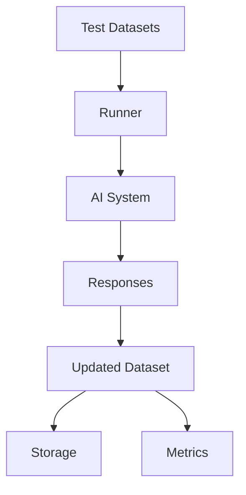

# Runners Overview

Runners execute test datasets against AI systems and collect responses for evaluation.

## Why Use Runners?

<CardGroup cols={2}>
  <Card title="Automated Testing" icon="robot">
    Execute tests against any AI system automatically
  </Card>
  <Card title="Multiple Backends" icon="server">
    Support for Alquimia, LLMs, and custom systems
  </Card>
  <Card title="Async Execution" icon="bolt">
    Efficient asynchronous batch processing
  </Card>
  <Card title="Detailed Metrics" icon="chart-bar">
    Track execution times and success rates
  </Card>
</CardGroup>

## Installation

```bash
uv pip install "alquimia-fair-forge[runners]"
```

## Quick Start

```python
from fair_forge.runners import AlquimiaRunner
from fair_forge.schemas import Dataset, Batch

# Create runner
runner = AlquimiaRunner(
    base_url="https://api.alquimia.ai",
    api_key="your-api-key",
    agent_id="your-agent-id",
    channel_id="your-channel-id",
)

# Create test dataset
dataset = Dataset(
    session_id="test-001",
    assistant_id="my-assistant",
    language="english",
    context="",
    conversation=[
        Batch(
            qa_id="q1",
            query="What is the capital of France?",
            assistant="",  # Will be filled by runner
            ground_truth_assistant="Paris",
        ),
    ],
)

# Execute tests
updated_dataset, summary = await runner.run_dataset(dataset)

print(f"Success rate: {summary['successes']}/{summary['total_batches']}")
```

## Available Runners

| Runner | Use Case | Requirements |
|--------|----------|--------------|
| `AlquimiaRunner` | Alquimia AI agents | Alquimia API credentials |
| Custom runners | Any AI system | Implement `BaseRunner` interface |

## Execution Modes

### LLM Mode (Lambda)

Execute tests directly against any LangChain-compatible LLM:

```bash
curl -X POST "https://your-lambda-url/run" \
  -H "Content-Type: application/json" \
  -d '{
    "connector": {
      "class_path": "langchain_groq.chat_models.ChatGroq",
      "params": {"model": "llama-3.1-8b-instant", "api_key": "..."}
    },
    "datasets": [...]
  }'
```

### Alquimia Mode

Execute tests against Alquimia AI agents:

```python
runner = AlquimiaRunner(
    base_url="https://api.alquimia.ai",
    api_key="your-api-key",
    agent_id="your-agent-id",
    channel_id="your-channel-id",
)
```

## Workflow

<Frame>

</Frame>

## Execution Summary

Each run returns a summary with metrics:

```python
summary = {
    "session_id": "test-001",
    "total_batches": 10,
    "successes": 9,
    "failures": 1,
    "total_execution_time_ms": 5432.1,
    "avg_batch_time_ms": 543.2,
}
```

## Next Steps

<CardGroup cols={2}>
  <Card title="AlquimiaRunner" icon="rocket" href="/runners/alquimia-runner">
    Learn about the Alquimia runner
  </Card>
  <Card title="Custom Runners" icon="code" href="/runners/custom-runners">
    Create your own runner
  </Card>
  <Card title="Storage" icon="database" href="/storage/overview">
    Save and load results
  </Card>
</CardGroup>
